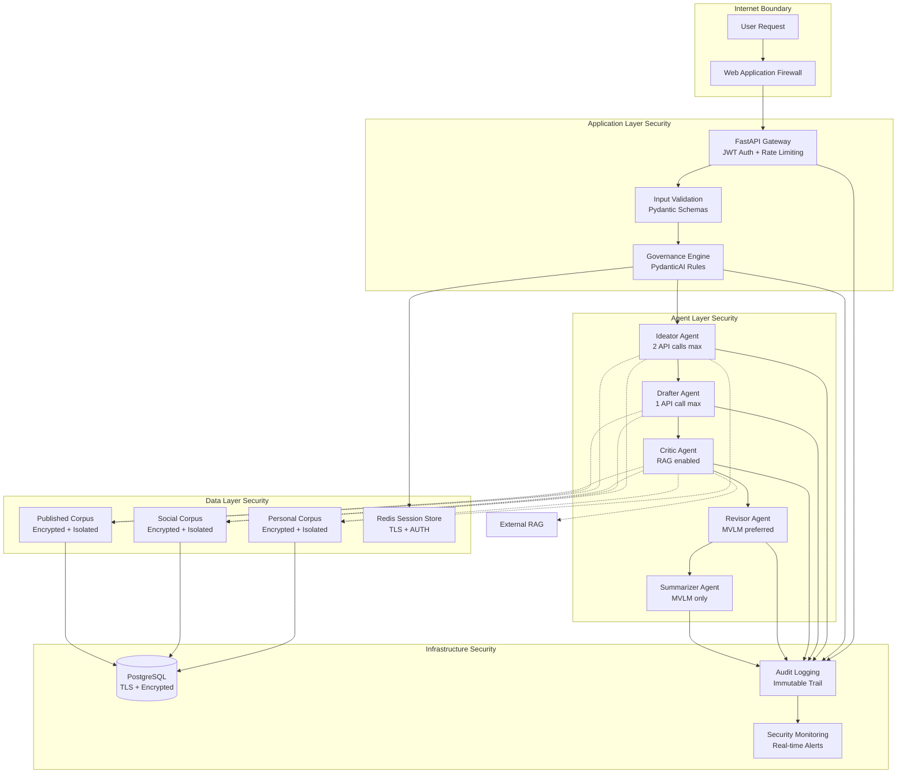

# Security Architecture Document

**Document Version**: 1.0  
**Last Updated**: 2024-09-01  
**Status**: APPROVED  
**Classification**: INTERNAL USE  

---

## 🎯 Executive Summary

This document defines the comprehensive security architecture for the Multi-Corpus Governance Agent (MCG) system. The architecture implements a **governance-first security model** where all access controls, permissions, and safety measures are enforced through the core governance layer using PydanticAI's agent orchestration framework.

### Key Security Principles
1. **Zero Trust Architecture**: Every request validated regardless of source
2. **Defense in Depth**: Multiple security layers with no single point of failure
3. **Governance-Enforced Security**: All security rules enforced through agent governance
4. **Immutable Audit Trail**: Complete traceability of all actions and decisions
5. **Fail-Safe Defaults**: System fails securely when components malfunction

---

## 🏗️ Overall Security Architecture



---

## 🛡️ Security Zones and Trust Boundaries

### Zone 1: Public Internet (Untrusted)
- **Threat Level**: HIGH
- **Controls**: WAF, DDoS protection, geographic filtering
- **Validation**: All input treated as malicious until proven otherwise

### Zone 2: Application Gateway (Partial Trust)
- **Threat Level**: MEDIUM  
- **Controls**: JWT authentication, rate limiting, input validation
- **Validation**: Authenticated users with limited initial trust

### Zone 3: Agent Execution Layer (Controlled Trust)
- **Threat Level**: LOW-MEDIUM
- **Controls**: Governance rules, API call limits, permission validation
- **Validation**: Trusted execution with strict governance enforcement

### Zone 4: Data Storage Layer (High Trust)
- **Threat Level**: LOW
- **Controls**: Encryption at rest/transit, access logging, corpus isolation
- **Validation**: Authenticated and authorized access only

### Zone 5: Infrastructure Layer (Highest Trust)
- **Threat Level**: MINIMAL
- **Controls**: Network segmentation, encrypted communications, monitoring
- **Validation**: Internal system communications with full encryption

---

## 🔒 Authentication and Authorization Architecture

### Multi-Factor Authentication Flow
```
User Login Request
    ↓
JWT Token Generation
    ↓
Token Validation Middleware
    ↓
Role-Based Permission Check
    ↓
Agent-Specific Authorization
    ↓
Corpus Access Validation
    ↓
Action Execution with Logging
```

### Authorization Matrix

| Agent Role | Personal Corpus | Social Corpus | Published Corpus | External RAG | API Calls | MVLM Access |
|------------|----------------|---------------|------------------|--------------|-----------|-------------|
| **Ideator** | ✅ Read | ✅ Read | ✅ Read | ❌ | Max 2 | ✅ |
| **Drafter** | ❌ | ✅ Read (limited) | ✅ Read (limited) | ❌ | Max 1 | ✅ |
| **Critic** | ✅ Read | ✅ Read | ✅ Read | ✅ Read | Max 2 | ✅ |
| **Revisor** | ❌ | ✅ Read (inherited) | ✅ Read (inherited) | ❌ | Max 1 (fallback) | ✅ Primary |
| **Summarizer** | ❌ | ❌ | ❌ | ❌ | 0 (fallback only) | ✅ Only |

---

## 🚨 Threat Model Analysis

### STRIDE Threat Classification

#### **Spoofing Identity**
- **Threat**: Unauthorized access using fake credentials
- **Controls**: 
  - Strong JWT implementation with short expiration
  - Multi-factor authentication for admin access
  - Agent identity verification before corpus access
- **Monitoring**: Failed authentication attempts, unusual login patterns

#### **Tampering with Data** 
- **Threat**: Malicious modification of corpus data or agent outputs
- **Controls**:
  - Immutable audit logs with cryptographic signatures
  - Input validation at every agent boundary
  - Read-only corpus access (no agent can modify stored data)
- **Monitoring**: Data integrity checks, unauthorized modification attempts

#### **Repudiation**
- **Threat**: Users or agents denying their actions
- **Controls**:
  - Complete audit trail with attribution for every action
  - Cryptographically signed log entries
  - Non-repudiable source tracking for all content
- **Monitoring**: Audit log integrity, missing log entries

#### **Information Disclosure**
- **Threat**: Unauthorized access to sensitive corpus data
- **Controls**:
  - Corpus isolation with access control validation
  - Encryption at rest and in transit
  - Agent-specific permission enforcement
- **Monitoring**: Unauthorized corpus queries, data exfiltration attempts

#### **Denial of Service**
- **Threat**: System unavailability through resource exhaustion
- **Controls**:
  - API call limits per agent (governance-enforced)
  - Rate limiting at application gateway
  - Resource monitoring and automatic scaling
- **Monitoring**: Request rate anomalies, resource utilization spikes

#### **Elevation of Privilege**
- **Threat**: Agents or users gaining unauthorized permissions
- **Controls**:
  - Runtime governance validation for every action
  - Immutable permission matrix in PydanticAI tools
  - No privilege escalation paths in agent design
- **Monitoring**: Unauthorized access attempts, permission boundary violations

---

## 🔐 Data Protection Strategy

### Encryption Standards
- **At Rest**: AES-256 encryption for all database storage
- **In Transit**: TLS 1.3 for all network communications
- **In Memory**: Sensitive data cleared after use, no persistent memory storage
- **Backup**: Encrypted backups with separate key management

### Data Classification
```
┌─────────────────┬──────────────┬─────────────┬─────────────────┐
│ Classification  │ Examples     │ Access Level│ Retention       │
├─────────────────┼──────────────┼─────────────┼─────────────────┤
│ PUBLIC          │ Published    │ All Agents  │ Indefinite      │
│                 │ articles     │             │                 │
├─────────────────┼──────────────┼─────────────┼─────────────────┤
│ INTERNAL        │ Social posts │ Limited     │ 2 years         │
│                 │ metadata     │ Agents      │                 │
├─────────────────┼──────────────┼─────────────┼─────────────────┤
│ CONFIDENTIAL    │ Personal     │ Authorized  │ User-controlled │
│                 │ messages     │ Agents Only │                 │
├─────────────────┼──────────────┼─────────────┼─────────────────┤
│ RESTRICTED      │ System logs  │ Admin Only  │ 7 years         │
│                 │ credentials  │             │                 │
└─────────────────┴──────────────┴─────────────┴─────────────────┘
```

---

## ⚙️ Implementation Security Controls

### PydanticAI Security Integration
```python
# Example: Governance-enforced corpus access
@agent.tool
async def secure_corpus_query(
    ctx: RunContext[AgentInput], 
    corpus: str, 
    query: str
) -> str:
    # 1. Validate agent permissions
    if not GovernanceRules.validate_corpus_access(ctx.deps.agent_role, corpus):
        await SecurityLogger.log_violation(
            agent=ctx.deps.agent_role,
            violation_type="unauthorized_corpus_access",
            corpus=corpus,
            context=ctx.deps.task_id
        )
        raise UnauthorizedCorpusAccessError(ctx.deps.agent_role, corpus)
    
    # 2. Rate limiting check
    if not RateLimiter.check_agent_limits(ctx.deps.agent_role):
        raise APICallLimitExceededError(ctx.deps.agent_role)
    
    # 3. Input sanitization
    sanitized_query = InputValidator.sanitize_corpus_query(query)
    
    # 4. Execute with full audit trail
    result = await CorpusConnector.secure_query(corpus, sanitized_query)
    
    # 5. Log successful access with attribution
    await AuditLogger.log_corpus_access(
        agent=ctx.deps.agent_role,
        corpus=corpus,
        query_hash=hashlib.sha256(query.encode()).hexdigest(),
        result_count=len(result.snippets),
        task_id=ctx.deps.task_id
    )
    
    return result
```

### Security Validation Framework
```python
class SecurityValidator:
    @staticmethod
    async def validate_agent_request(agent_input: AgentInput) -> SecurityResult:
        """Comprehensive security validation before agent execution"""
        
        # Input validation
        InputValidator.validate_request_format(agent_input)
        
        # Content safety check
        SafetyFilter.check_content_safety(agent_input.content)
        
        # Rate limiting
        RateLimiter.validate_request_rate(agent_input.task_id)
        
        # Governance rule pre-check
        GovernanceValidator.pre_validate_request(agent_input)
        
        return SecurityResult.APPROVED
```

---

## 📊 Security Monitoring and Alerting

### Real-Time Security Metrics
- **Authentication Failures**: > 5 failures/minute from same IP
- **Governance Violations**: Any unauthorized corpus/RAG access attempt
- **Rate Limit Violations**: Agent exceeding API call limits
- **Anomalous Patterns**: Unusual request volumes or patterns
- **Data Access Anomalies**: Access to unusual corpus combinations

### Alert Severity Levels
```
🚨 CRITICAL (P0): Immediate response required
- Governance rule bypass detected
- Unauthorized data access confirmed
- Security control failure
- Multiple authentication failures

⚠️  HIGH (P1): Response within 1 hour
- Unusual access patterns detected
- Rate limiting failures
- Configuration drift detected

📊 MEDIUM (P2): Response within 4 hours  
- Performance anomalies
- Non-critical security warnings
- Audit log irregularities
```

---

## 🔄 Security Review and Updates

### Regular Security Assessments
- **Weekly**: Security log review and anomaly analysis
- **Monthly**: Threat model validation and update
- **Quarterly**: Complete security architecture review  
- **Annually**: Third-party penetration testing and audit

### Security Metrics Tracking
- Mean Time to Detect (MTTD) security incidents
- Mean Time to Respond (MTTR) to security alerts
- Governance rule compliance percentage (target: 100%)
- False positive rate for security alerts (target: <5%)

---

## ✅ Security Validation Checklist

### Pre-Deployment Security Verification
- [ ] All governance rules tested and validated
- [ ] Authentication and authorization working correctly
- [ ] Encryption enabled for all data storage and transmission
- [ ] Audit logging capturing all required events
- [ ] Rate limiting and API controls functioning
- [ ] Security monitoring alerts configured and tested
- [ ] Incident response procedures documented and rehearsed
- [ ] Third-party security scan completed with no critical findings

---

**Document Approval:**
- Security Team Lead: [Name] - [Date]
- Development Team Lead: [Name] - [Date]  
- Compliance Officer: [Name] - [Date]

**Next Review Date**: 2024-12-01